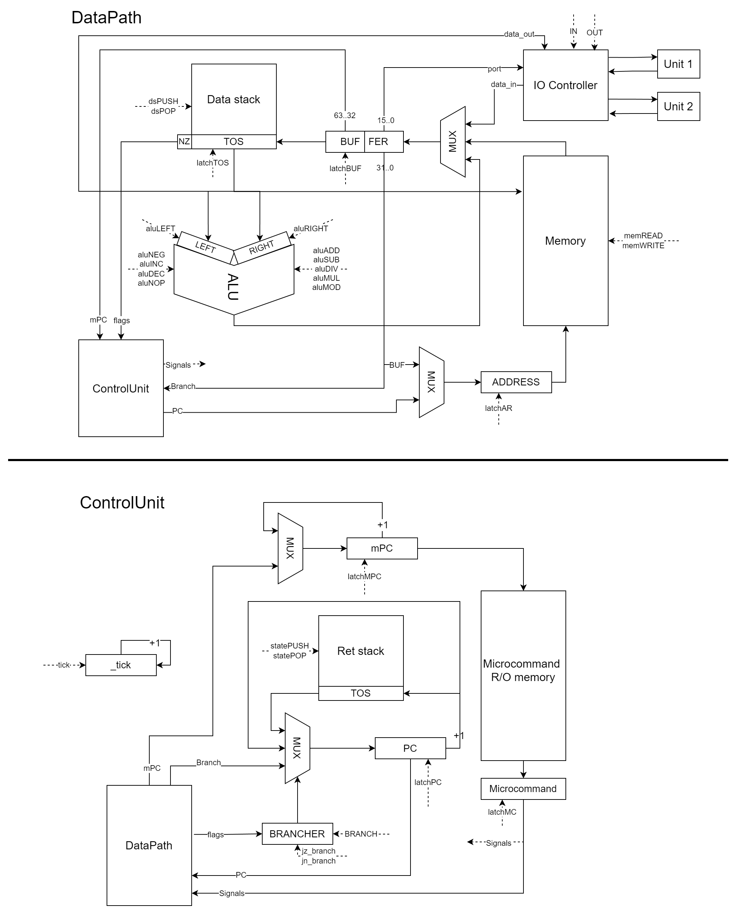

# CSA_Lab3

Лабораторная работа #3 по дисциплине "Архитектура компьютера"\
Выполнил: Щербинин Эдуард Павлович, P3214

Вариант из таблицы:\
`asm | stack | neum | mc -> hw | instr | struct | stream | port | cstr | prob2 | cache`\
Выполнена в базовом варианте:\
`asm | stack | neum | mc | tick | struct | stream | port | cstr | prob2 | -`

## Язык программирования

### Синтаксис

```ebnf
<program> ::= <line>+

<line> ::= <label> <comment>? '\n'
       | <instr> <comment>? '\n'
       | <comment>? '\n'

<label> ::= <label_name> ':'

<label_name> ::= [a-zA-Z_]+

<instr> ::= <op0>
        | <op1> ' ' <label_name>
        | <op1> ' ' [1-9] [0-9]*
        | <op1> ' 0x' [1-9a-f] [0-9a-f]*
        | "word" ' ' ".*"
        
<op0> ::= "nop"
      | "pop"
      | "push_by"
      | "pop_by"
      | "swap"
      | "add"
      | "sub"
      | "mul"
      | "div"
      | "mod"
      | "neg"
      | "inc"
      | "dec"
      | "dup"
      | "ret"
      | "hlt"

<op1> ::= "push"
      | "pop"
      | "jmp"
      | "jz"
      | "jn"
      | "call"
      | "in"
      | "out"
      | "resw"
      
      
<comment> ::= ' '* ';' [^\n]*

```

### Семантика

Код выполняется последовательно, одна инструкция за другой.

Метки определяются на отдельной строке исходного кода.
Чувствительны к регистру. Переопределение недопустимо.\
Метки могут быть использованы как аргумент (в т.ч. до определения)\
Адресация начинается с `0x1`. Адрес `0x0` интерпретируется как `NULL`.

Выполнение программы начинается с обязательной метки `_start`.

Доступны команды транслятора:

* `WORD <arg>` - объявить переменную в памяти
* `DB <arg>` - WORD alias
* `RESW <amount>` - зарезервировать в памяти буфер на `amount` машинных слов. Инициализируется нулями

Для набора инструкций см. [систему команд](#система-команд)\
Команды не чуствительны к регистру: `WORD == word`\
Символ `;` и всё после него (до конца строки) считается комментарием и будет проигнорировано

Пример использования:

```asm
decimal: ; Определение метки
    word 42 ; Инициализирует ячейку десячитным числом
    db 42 ; Эквивалент
hexadecimal:
    word 0xA ; Инициализирует ячейку шестнадцатеричным числом
message:
    word "Hello, world!", 0xA, 0 ; Инициализирует каждый символ строки в собственную ячейку по порядку
buffer:
    resw 256 ; Выделит в памяти 256 слов
    resw 0x100 ; Эквивалент

_start: ; начало выполнения программы
    push decimal ; Как аргумент команде передастся адрес метки decimal
```

## Организация памяти

### Основная память

* DRAM
* Архитектура: фон Неймана, данные **могут** интерпретироваться как команды, а команды - как данные
* Размер одной ячейки памяти - 64 бита
* Адресация - прямая абсолютная, поддерживается прямая загрузка на стек
* Доступ осуществляется по адресу, хранящемся в регистре `AR (Address reg)`
* Поддерживаются 31-битные беззнаковые адреса, наличие `1` в 31-м бите показывает прямую загрузку 31-битного знакового литерала на стек вместо обращения в память

### Стек

* 64-разрядный
* Вершина стека `TOS` представляет последний элемент стека, доступ к стеку возможен **исключительно** через `TOS`
* Аппаратно представляет собой SRAM память + регистр-указатель вершины стека, который по сигналу ин(де-)крементируется. Обращение к `TOS` является обращением к памяти по адресу в этом регистре

```text
           memory                             stack
+----------------------------+    +----------------------------+
| 00 : undefined (NULL)      |    | 00 :       ...             |
| 01 :      ...              |    |                            |
| part for variables/data/buf|    |           data             |
|           ...              |    |                            |
| n  : program start         |    |            ...             |
|           ...              |    |----------------------------|
| m  : hlt                   |    | n  :       TOS             |
+----------------------------+    +----------------------------+
```

Ячейка памяти `0x1` соответствует адресу первой инструкции.
Попытка обратиться к адресу `0x0` игнориуется.\
Рекомендуется задавать константы / выделять буфера в начале программы,
далее после метки `_start` задавать машинные инструкции,
для исключения вероятности выполнения данных как инструкций.

### Память микрокоманд

* Read-Only Memory
* Размер одной ячейки микрокоманды - 32 бита
* Каждый бит микрокоманды соответсвутет определённому сигналу

```text
     microcommand memory
+----------------------------+
| 00 : NOP, goto instr fetch |
| 01 : instruction fetch t1  |
| 02 : instruction fetch t2  |
| 03 :      ...              | 
|   microcoded instructions  |
|           ...              |
+----------------------------+
```

## Система команд

Особенности:

* Машинное слово - 64 бита
* Старшие 32 бита машинного слова указывают на адрес начала исполнения инструкции в памяти микрокоманд
* Младшие 32 бита - аргумент инструкции, в зависимости от 31-го бита будет либо загружен из памяти, либо прямой загузкой в стек
* Обработка данных осуществляется только в стеке данных через `TOS`
* Поток управления:
    * Значение счётчика команд `PC` инкрементируется после исполнения последней микрокоманды каждой инструкции
    * Значение счётчика микрокоманд `mPC` инкрементируется каждый такт, устанавливается на цикл выборки команды `0x1` после исполнения последней микрокоманды каждой инструкции
    * Поддерживаются безусловные и условные переходы

Набор инструкций (обозначения: `<аргумент>`, `{..., TOS-1, TOS}`, `[опционально]`):

* `NOP` – нет операции
* `PUSH <addr/lit>` - положить на вершину стека значение по адресу метки / прямое значение
* `POP [<addr>] {e1}` - снять значение с вершины стека и [положить по адресу метки]
* `PUSH_BY {e1}` - положить на вершину стека значение по адресу вершины стека e1
* `POP_BY {e1, e2}` - по адресу вершины стека e2 положить значение вершины стека e1
* `SWAP {e1, e2}` - положить 2 элемента стека в обратном порядке e2, e1
* `ADD {e1, e2}` – положить на стек результат операции сложения e1 + e2
* `SUB {e1, e2}` – положить на стек результат операции вычитания e1 – e2
* `MUL {e1, e2}` – положить на стек результат операции умножения e1 * e2
* `DIV {e1, e2}` – положить на стек результат операции _целочисленного_ деления e1 / e2
* `MOD {e1, e2}` – положить на стек результат операции взятия остатка e1 % e2.
* `NEG {e1}` – инвертировать знак элемента вершины стека
* `INC {e1}` – увеличить значение вершины стека на 1
* `DEC {e1}` – уменьшить значение вершины стека на 1
* `DUP {e1}` – дублировать элемент с вершины стека
* `JMP <addr>` - совершить переход по указанному адресу
* `JZ <addr>` - если TOS равен 0, совершить переход по указанному адресу
* `JN <addr>` - если TOS отрицательный, совершить переход по указанному адресу
* `CALL <addr>` - вызвать функцию по указанному адресу
* `RET` - вернуться из функции на следующую после вызова инструкцию
* `IN <port>` - получить данные из внешнего устройства по указанному порту и загрузить на стек
* `OUT <port>` - отправить данные во внешнее устройство по указанному порту со стека и снять его
* `HLT` - остановить программу

Если команда задействовала `{элемент стека}`, он будет снят со стека.

## Транслятор

CLI: `python translator.py <input_file> <target_file>`

Реализован в модуле [translator](./translator.py)\
Трансляция реализуется в два прохода:

1. Генерация машинного кода без адресов переходов и расчёт значений меток перехода
    * [Машинные инструкции](#система-команд) один в один транслируются в машинные команды
    * [Команды транслятора](#семантика) определяют напрямую начальное состояние памяти
2. Подстановка адресов меток в инструкции

## Модель процессора

CLI: `python machine.py <program_file> [<input_file>]`

Реализована в модуле [machine](./machine.py)

Описание:

* Микропрограммное управление
* Микрокод расшифровывается и исполняется посигнально
* Процесс моделирования – потактовый, каждый такт выводится в файл логирования
* Начало симуляции происходит в функции `simulation`
* Остановка моделирования проиходит в случае:
    * выполнения инструкции `HLT`
    * попытки получить элемент из пустого потока ввода
    * попытки получить значение из любого из пустых стеков
    * попытки положить значение на любой из заполненных стеков

Схема:

Не загружается изображение? Загляните [сюда](schema.png)

### DataPath

Реализован в модуле [datapath](./datapath.py)

Описание устройств:

* `ControlUnit` - [ControlUnit](#controlunit)
* `Data stack` - [стек данных](#стек), хранящий текущие данные для обработки
* `BUFFER` - дополнительный регистр, куда могут приходить различные значения, перед загрузкой на стек. Нужен для возможности получения доступа к двум различным операндам
* `ALU` - АЛУ, поддерживающее различные операции. Имеет дополнительные регистры для возможности последовательной загрузки и снятия нескольких операндов стека
* `Memory` - [основная память](#основная-память)
* `ADDRESS` - регистр, в котором хранится адрес памяти для обращения
* `IO Controller` - контроллер ввода-вывода, принимающий и декодирующий порт устройства, по сигналу читает или записывает в одно из устройств `Unit X` данные

Описание сигналов (все сигналы приходят от ControlUnit'а, исполняются за 1 такт):

* `dsPUSH` - положить значение на стек данных (инициализируется `0`)
* `dsPOP` - снять значение со стека данных
* `latchTOS` - защёлкнуть значение на вершине стека данных (из `BUFFER`)
* `latchBUF` - защёлкнуть значение в `BUFFER`
* `latchAR` - защёлкнуть значение в `ADDRESS`
* `memREAD` - прочитать значение из памяти по адресу в `ADDRESS`
* `memWRITE` - записать значение в память (из `TOS`) по адресу в `ADDRESS`
* `IN` - прочитать очередное значение из устройства ввода с портом в `BUFFER(15..0)`
* `OUT` - отправить значение (из `TOS`) устройству вывода с портом в `BUFFER(15..0)`
* `aluLEFT` - защёлкнуть значение в левом регистре АЛУ (из `TOS`)
* `aluRIGHT` - защёлкнуть значение в правом регистре АЛУ (из `TOS`)
* `aluNEG` - брать из левого регистра значение `- LEFT`
* `aluINC` - брать из левого регистра значение `LEFT + 1`
* `aluDEC` - брать из левого регистра значение `LEFT - 1`
* `aluNOP` - пропустить через АЛУ значение `LEFT`
* `aluADD` - пропустить через АЛУ значение `LEFT + RIGHT`
* `aluSUB` - пропустить через АЛУ значение `LEFT - RIGHT`
* `aluMUL` - пропустить через АЛУ значение `LEFT * RIGHT`
* `aluDIV` - пропустить через АЛУ значение `LEFT // RIGHT`
* `aluMOD` - пропустить через АЛУ значение `LEFT % RIGHT`

### ControlUnit

Реализован в модуле [controlunit](./controlunit.py)

Описание устройств:

* `DataPath` - [DataPath](#datapath)
* `_tick` - спец регистр-счётчик тиков
* `Ret stack` - [стек возвратов](#стек), в который можно положить текущее состояние `PC` либо снять предыдущее
* `PC` - счётчик команд, регистр, в котором хранится адрес очередной инструкции для исполнения
* `BRANCHER` - спец устройство-комбинационная схема, которая, учитывая сигналы, определеяет, какое значение пропустить мультиплексору в `PC`
* `mPC` - счётчик микрокоманд, регистр, в котором хранится адрес (памяти микрокоманд) очередной исполняемой микрокоманды
* `Microcommand memory` - Read-only [память микрокоманд](#память-микрокоманд), выдаёт всегда значение по адресу в `mPC`
* `Microcommand` - регистр, в котором хранится текущая исполняемая микрокоманда для ее декодирования по сигналам

Описание сигналов (исполняются за 1 такт):

* `tick` - инкременитировать значение счётчика тиков, приходит строго каждый такт
* `latchPC` - защёлкнуть значение в счётчике команд
* `latchMPC` - защёлкнуть значение в счётчике микрокоманд
* `latchMC` - защёлкнуть значение в регистре микрокоманд из памяти микрокоманд
* `statePUSH` - положить и защёлкнуть на стеке возвратов значение `PC`
* `statePOP` - снять значение со стека возвратов
* `BRANCH` - сигнал перехода (пропустить в `PC` значение перехода)
* `jz_branch` - совершить `BRANCH` только если `Z-flag` - истина
* `jn_branch` - совершить `BRANCH` только если `N-flag` - истина

